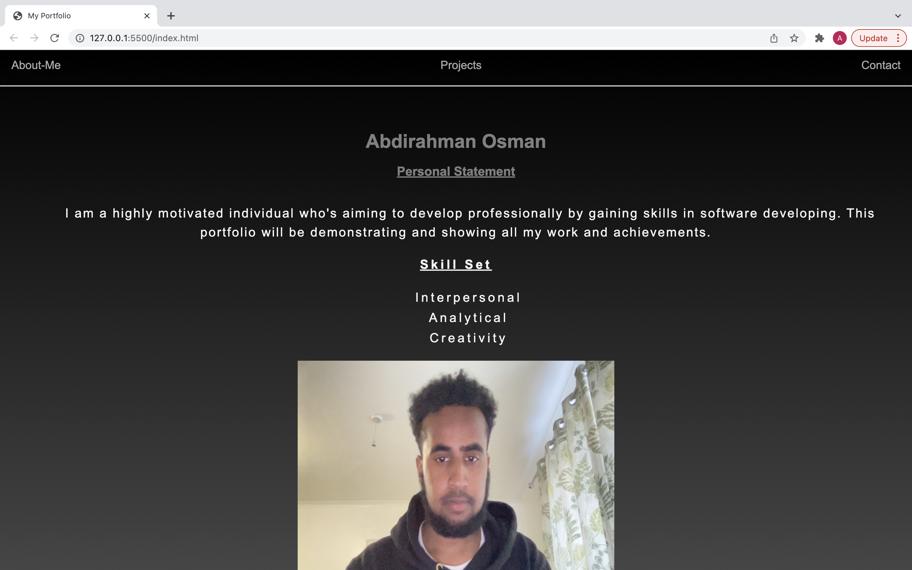
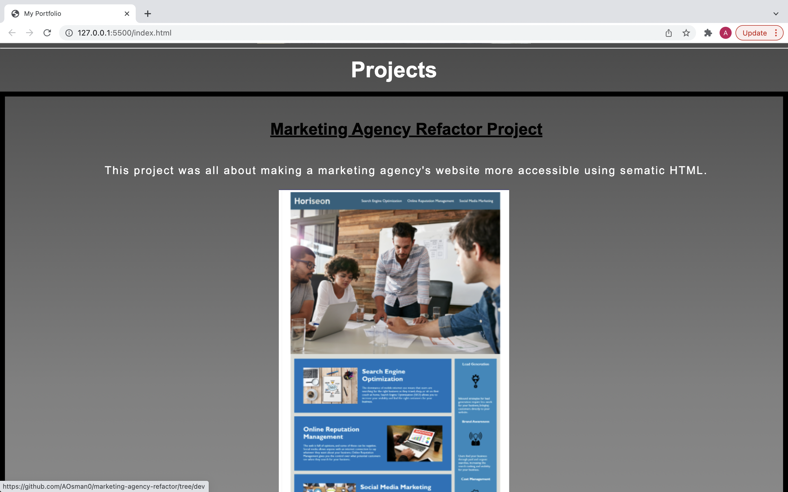
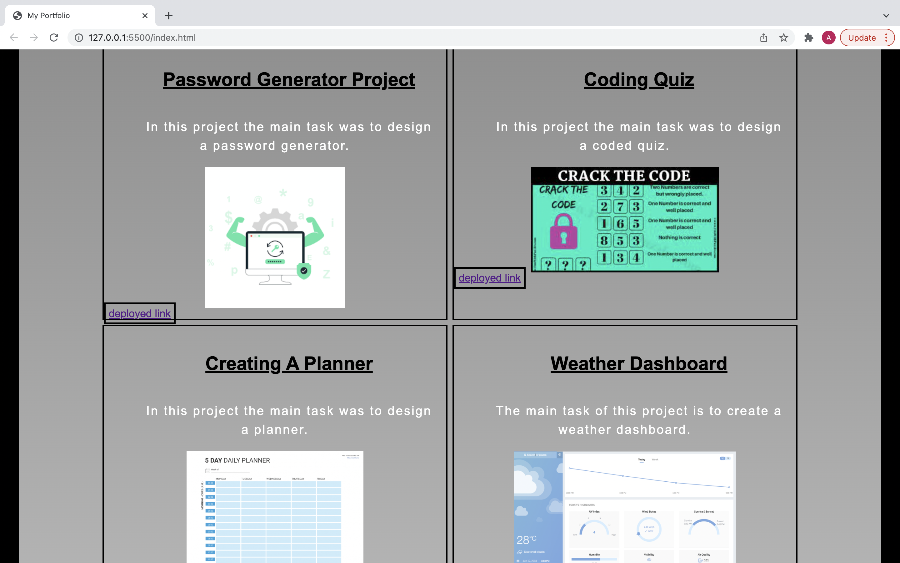
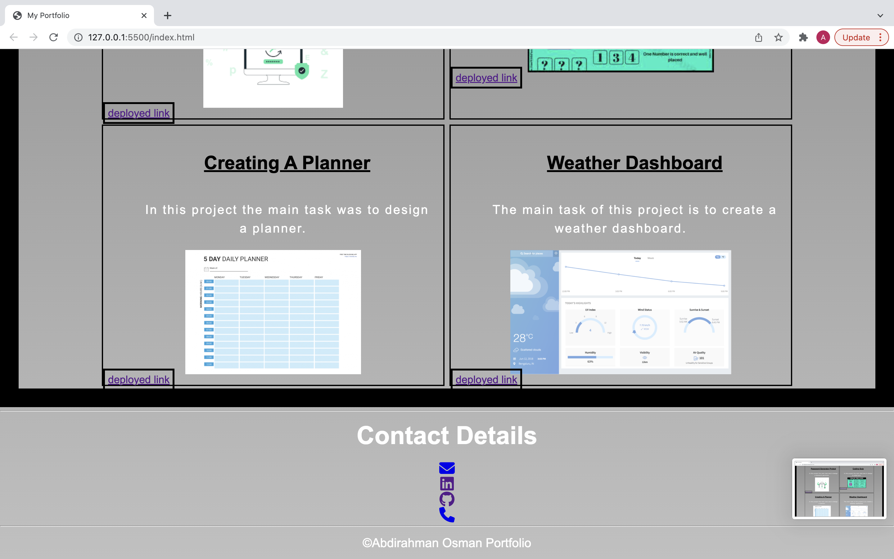

# portfolio

advanced css: portfolio

## Creating a professional portfolio

This task had involved creating my own professional portfolio. I wrote the HTML and CSS code required for a responsive layout that adapts to my viewports .

## Deployed URL

This is the link to the github repository below.

[here](https://github.com/AOsman0/portfolio/tree/dev)

## Screenshots

Below are screenshots of desktop viewport.

## Screenz-Recording

Below is the screenrecording demonstrating a responsive layout.

## Technology Used

- Visual Studio Code
- HTML
- CSS
- GitHub
- Terminal
