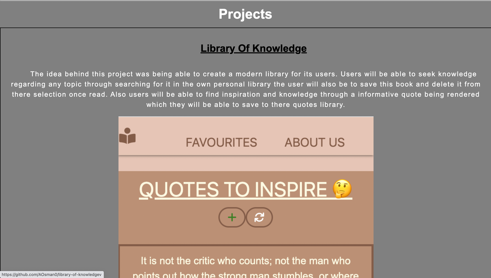
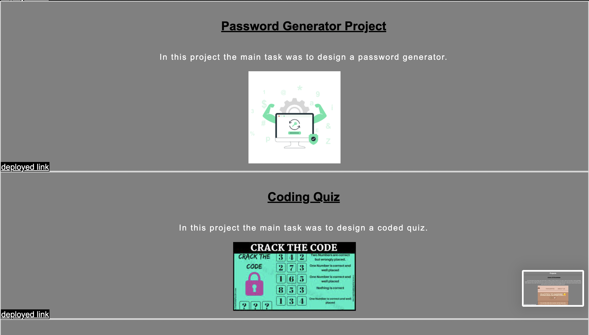
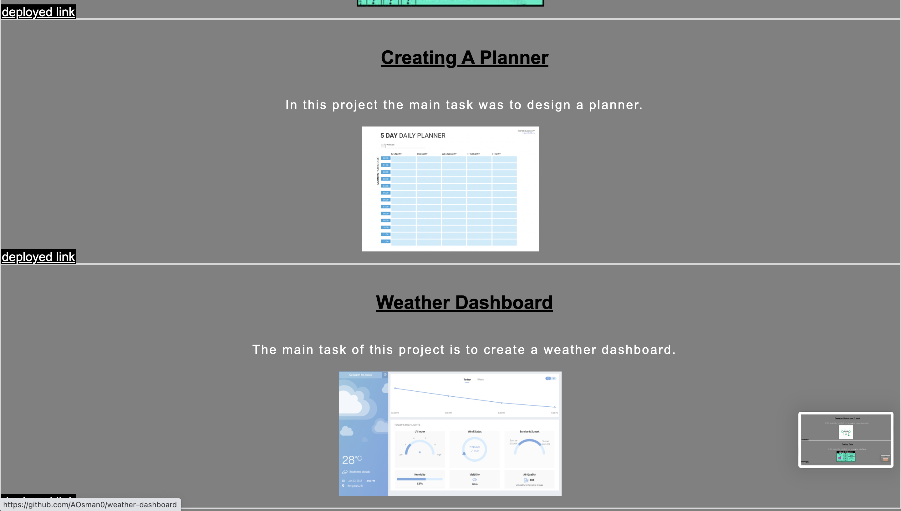
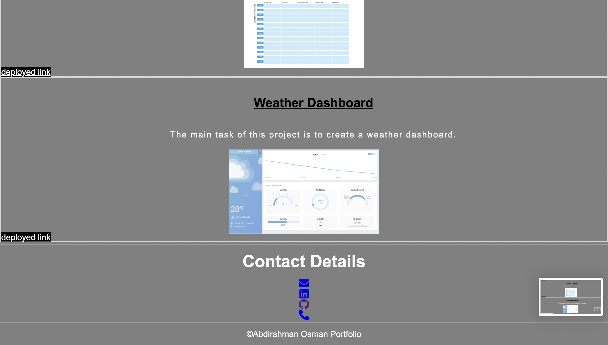

# portfolio

advanced css: portfolio

## Creating a professional portfolio

This task had involved creating my own professional portfolio. I wrote the HTML and CSS code required for a responsive layout that adapts to my viewports .

## Deployed URL

This is the link to the deployed link of my portfolio.

[here](https://aosman0.github.io/portfolio/)

## Screenshots

Below are screenshots of the updated version of my portfolio.
I have now made sure all the links are deployed to the correct pages of all the projects i have worked on.

## Screen-Recording

Below is the screen recording demonstrating a responsive layout.

https://drive.google.com/file/d/1MpJCO9kBRy-H4rrRHVE1ExcGVko-mvKx/view?usp=sharing

## Technology Used

- Visual Studio Code
- HTML
- CSS
- GitHub
- Terminal
